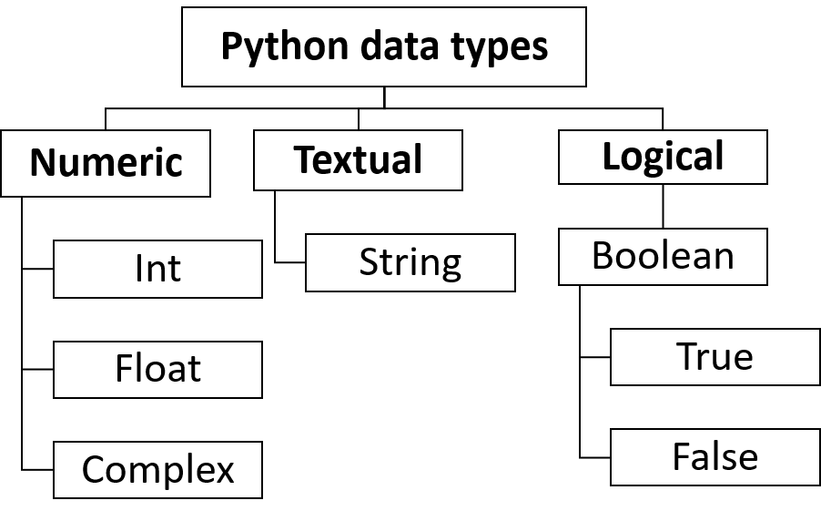
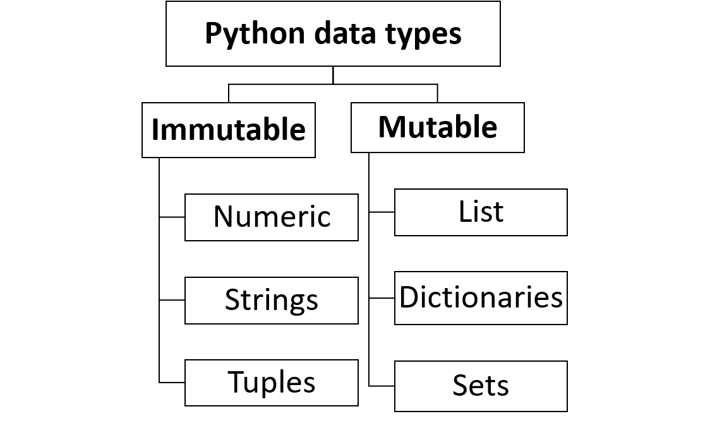

#BASICS-IN-PYTHON-PROGRAMMING
------------------------------

  1. An Introduction
  -------------------
Python is an interpreted, high-level, general-purpose programming language. Created by Guido van Rossum and first released in 1991.
Python has a design philosophy that emphasizes code readability, notably using significant whitespace.
It provides constructs that enable clear programming on both small and large scales.
It is open source software, well documented and vast community to support you. Python is well used in the following fields,
		
	Machine Learning and AI,
	Developing GUI apps,
	Games and 3D graphics,
	Scientific and Numerics,
	Used as scripting language and go on.

It has vast libraries and packages that will help you in anywhere, few notable libraries in python are,

	Data Science - Numpy,NLTK,Matplotlib,scipy,pandas, etc,
	Web Scrapping - Scrapy, Beautiful soup, etc,
	GUI Development -PyQT,Kivy, etc.
	
  2. Basic Elements in Python
  -----------------------------
    2.1. Variables, Identifiers and Keywords
    ----------------------------------------
  		2.1.1. Variables:
  		-----------------
  		   - Variables are reserved locations in a computer memory to store values.
  		   - we can store data type such as integer,strings,list, etc in a variable.
  		   - variables are stored in stack and their values are stored in heap.
  		   - It does have value,scope,type,scope, etc.
  		   - Python supports Dynamic Typing i.e. Dynamic memory allocation.(Hope you know about stack and heap)

  		    e.g:
  		    		a=10;
  		    		list1=[4,5,3,2,1]
  		    		dic1={1:'jagan',2:'nathan'}
  		    	Here, a,list1,dic1 are variables which holds some values.

  		2.1.2. Identifiers:
  		-------------------
  			- Identifier is the name given to entities like variables,functions,objects etc.
  			- The name of the variable is an identifier.
  			- It doesn't have value,scope,type,scope, etc.

  			Rules for identifier

  				- Case sensitive,
  				- Only Number,letters and underscore is allowed rest of the keywords are not allowed.
  		
  		2.1.3. Keywords:
  		----------------
  			- Keywords are predefined names used as syntax for certain function, loops.
  			- Keywords can't be used in any other ways, otherwise it's a error.

  			e.g:
  					function a:
  						...
  						if ():
  							...
  						...

  				function,if,else,while,for class int,list,tuple,in are some of the keywords in python.

  	2.2. Data Types and Data Structure
  	-----------------------------------
  		The data types in python is given in the below picture. Since python supports dynamic typing, we don't have to
  		initialize any variable. Based on the type of object assigned to the variable, python itself declare the object.

		
		Further, based on the mutablility, data types are further classified as following.
			- The Object are able to modify even after the creation, such object is said to be mutable object.
			- The Object are not able to modify once it's created, such object is said to be immutable object.

		2.1. Numeric Data types:
		------------------------
			- In python, based on the value of number python will assign the varible and allocate the memory for various numeric data type such as int, float and complex.

			e.g:

					a=4
					b=34244.53423478
					c=4+5j

				Here a is a int, b is a float, c is a complex numeric data types

		2.2. Strings
		-------------
			- String is a sequence of charecters. It is enclosed in single quotes ('') or double quotes("").
			- Python allows Indexing for the srings. Indexing is the process of accessing each charecter or elemet by their index.

			e.g:

					a="earth"
					b="""earth's climate is "hotter" than the sun""" #quotes can be used inside string(when enclosed by triple quotes)
					print(a[2])  #will print letter "r" in variable a

			2.2.1. String manipulation:
			--------------------------
			2.2.1.1. string concordination(+):
			----------------------------------
				- It is the process of adding one string to another.
				-  '+' is used for concordination.

				e.g:
					a="jagan"
					b="nathan"
					c=a+b
					print (c)  # will give "jagannathan"
			2.2.1.2. string Repetition(*):
			-------------------------------
				- It is the process of repeting the strings.
				-  '*' is used for repetition.

				e.g:
					a="jagan"
					b=a*2
					print (b)  # will give "jaganjagan"

			2.2.2. Commonly used methods in strings:
			----------------------------------------
				- Since string is immutable object, most of the methods in string returns a value without altering the original variable.
				- Some of the commonly used methods are,

					2.2.2.1. capitalize():
					----------------------
						- This method will capitalize first letter of the given string.
						-  syntax:    <string_var_name>.capitalize()

						e.g:
							a="we loves python"
							b=a.capitalize()
							print(b)  # gives "We loves python"

					2.2.2.2. upper():
					----------------------
						- This method will convert all the elements into upper case.
						-  syntax:    <string_var_name>.upper()

						e.g:
							a="we loves python"
							b=a.upper()
							print(b)  # gives "WE LOVES PYTHON"

					2.2.2.3. lower():
					----------------------
						- This method will convert all the elements into lower case.
						-  syntax:    <string_var_name>.lower()

						e.g:
							a="We Loves PYTHON"
							b=a.upper()
							print(b)  # gives "we loves python"

					2.2.2.4. title():
					----------------------
						- This method will convert given string into title case.
						-  syntax:    <string_var_name>.title()

						e.g:
							a="We loves pYTHON"
							b=a.upper()
							print(b)  # gives "We Loves Python"

					2.2.2.5. count("string",start_index,ending_index):
					--------------------------------------------------
						- This method will return the count of occurance of a string in the given string provided starting and ending index.

						-  syntax:    <string_var_name>.count("string",start_index,ending_index)

						e.g:
							a="my name is my pYTHON"
							b=a.count("my")        # b=2
							c=a.count("my",0,20)   # c=2
							d=a.count("my",5,20)   # d=1
							print(b,c,d)           # gives 2,2,1

					2.2.2.6. swapcase():
					--------------------
						- This method will return the string by swaping the case of the input string.
						-  syntax:    <string_var_name>.swapcase()

						e.g:
							a="jAGAN1234"
							b=a.swapcase()        # "Jagan1234"
							print(b)           

					2.2.2.7. index("string",start_index,ending_index):
					------------------------------------------------
						- This method will return lowest index of a string in the given string provided between starting and ending index.
						- If it doesn't find the index, it will throw error.
						-  syntax:    <string_var_name>.index("string",start_index,ending_index)

						e.g:
							a="my name is pYTHON"
							b=a.index("my")        # b=0
							c=a.index("my",0,20)   # c=0
							d=a.index("my",5,20)   # error
							print(b,c,d)           # gives 0,0,(error)

					2.2.2.8. isdigit():
					------------------------------------------------
						- This method will check whether the given string has digits or not.
						- It doesn't check for other language numbers.
						- It will return
								True - if all elements are digits (0-9).
								False - if it has one or more non-digits.
						-  syntax:    <string_var_name>.isdigit()

						e.g:
							a="jagan123"
							b="123456"
							c="三1234"   #  "三" is three in chinese
							d=a.isdigit()        # False
							e=b.isdigit()        # True
							f=c.isdigit()        # False
							print(d,e,f)           # gives False, True, False

					2.2.2.9. isnumeric():
					------------------------------------------------
						- This method will check whether the given string has digits or not.
						- It will check for other language number as well
						- It will return
								True - if all elements are digits (0-9).
								False - if it has one or more non-digits.
						-  syntax:    <string_var_name>.isnumeric()

						e.g:
							a="jagan123"
							b="123456"
							c="三1234"   #  "三" is three in chinese
							d=a.isdigit()        # False
							e=b.isdigit()   # True
							f=c.isdigit()        # False
							print(d,e,f)           # gives False, True, True
					
					2.2.2.10. isalpha():
					--------------------
						- This method will check whether the given string has alphabets or not.
						- It will return
								True - if all elements are alphabets (a-z,A-Z).
								False - if it has one or more digits.
						-  syntax:    <string_var_name>.isalpha()

						e.g:
							a="jagan123"
							b="jagan"
							c=a.isalpha()        # False
							d=b.isalpha()   	 # True
							print(c,d)           # gives False, True

					2.2.2.11. isalnum():
					--------------------
						- This method will check whether the given string has digits and alphabets.
						- It will return
								True - if all elements are digits or alphabets (0-9,a-z,A-Z).
								False - if it has one or more non-digits and non-alphabets.
						-  syntax:    <string_var_name>.isalnum()

						e.g:
							a="jagan123"
							b="jagan_55"         # "_" is non-digit and non-alphabet
							c=a.isalnum()        # True
							d=b.isalnum()	     # False
							print(c,d)           # gives True, False

					2.2.2.12. islower():
					--------------------
						- This method will check whether the given string has alphabets which are lower case (digits are allowed).
						- It will return
								True - if all alphabets are lower case (a-z).
								False - if it has one or more non-lower case alphabets.
						-  syntax:    <string_var_name>.islower()

						e.g:
							a="jagan123"
							b="Jagan"
							c=a.islower()        # True
							d=b.islower()	     # False
							print(c,d)           # gives True, False

					2.2.2.13. isupper():
					--------------------
						- This method will check whether the given string has all alphabets which are upper case (digits are allowed).
						- It will return
								True - if all elements are upper case (A-Z).
								False - if it has one or more non-upper case alphabets.
						-  syntax:    <string_var_name>.isupper()

						e.g:
							a="JAGAN123"
							b="Jagan"
							c=a.islower()        # True
							d=b.islower()	     # False
							print(c,d)           # gives True, False

					2.2.2.14. max(string,*iterables):
					---------------------------------
						- This method will return the maximum item from the given string/list.
						- It will return maximum from string as per it's ASCII value
						-  syntax:    max(string,*iterables)

						e.g:
							a=[1,2,3,4,5]
							b="Zzxyabcde"
							c=max(a)    		#5
							d=max(b)    		#z as per ASCII table   
							print(c,d)  		#5, z

					2.2.2.15. min(string,*iterables):
					---------------------------------
						- This method will return the minimum item from the given string/list.
						- It will return minimum from string as per it's ASCII value
						-  syntax:    min(string,*iterables)

						e.g:
							a=[1,2,3,4,5]
							b="Zzxyabcde"
							c=min(a)    		#5
							d=min(b)    		#Z as per ASCII table   
							print(c,d)  		#5, Z

					2.2.2.15. split(delimiter):
					---------------------------
						- This method will split the given string into list as per the given delimiter and number of times the split will happen.
						-  syntax:    <string>.split(delimiter,number_of_times_split_to_happen)

						e.g:
							a="9-8-7-6-5-4-3-2-1-0"
							c=a.split('-')    		#split all the elements
							d=a.split('-',5)    	#split happen for 5 times only
							print(c,d)  			#['9','8','7','6','5','4','3','2','1','0'],['9','8','7','6','5','4-3-2-1-0']

					2.2.2.16. join(string):
					-----------------------
						- This method will join the given list(all element must be string) or string into a string with delimiter in it.
						-  syntax:    <delimiter>.join(string/list)

						e.g:
							a=['9','8','7','6','5','4','3','2','1','0']
							b="9876543210"
							c='-'.join(a)    		#"9-8-7-6-5-4-3-2-1-0"
							d='-'.join(b)           #"9-8-7-6-5-4-3-2-1-0"
							print(c,d)  

					2.2.2.17. strip(<charecter>):
					---------------------------
						- This method will remove all leading and trailing charecter only as specified in argument.
						- syntax:    <string>.strip(<charecter>)

						e.g:
							a="--98765--43210--"
							b=a.strip('-')    		#"98765--43210"
							print(b)  

					2.2.2.18. lstrip(delimiter):
					---------------------------
						- This method will remove all leading charecter only as specified in argument.
						- syntax:    <string>.lstrip(<charecter>)

						e.g:
							a="--98765--43210--"
							b=a.lstrip('-')    		#"98765--43210--"
							print(b)  

					2.2.2.19. rstrip(delimiter):
					---------------------------
						- This method will remove all trailing charecter only as specified in argument.
						- syntax:    <string>.rstrip(<charecter>)

						e.g:
							a="--98765--43210--"
							b=a.strip('-')    		#"--98765--43210"
							print(b)  

					2.2.2.20. len(string):
					----------------------
						- This method will return the length of the string.
						- syntax:    len(string)

						e.g:
							a="9876543210"
							b=len(a)    		#10
							print(b)  	

					2.2.2.20. len(string):
					----------------------
						- This method will return the length of the string.
						- syntax:    len(string)

						e.g:
							a="9876543210"
							b=len(a)    		#10
							print(b)  	

					2.2.2.20. len(string):
					---------------------------
						- This method will return the length of the string.
						- syntax:    len(string)

						e.g:
							a="9876543210"
							b=len(a)    		#10
							print(b)  	

					2.2.2.20. len(string):
					---------------------------
						- This method will return the length of the string.
						- syntax:    len(string)

						e.g:
							a="9876543210"
							b=len(a)    		#10
							print(b)  	

					2.2.2.20. len(string):
					---------------------------
						- This method will return the length of the string.
						- syntax:    len(string)

						e.g:
							a="9876543210"
							b=len(a)    		#10
							print(b)  																																			

					2.2.2.21. find("string",start_index,ending_index):
					------------------------------------------------
						- This method will return lowest index of a string in the given string provided between starting and ending index.
						- If it doesn't find the index, it will return -1.
						-  syntax:    <string_var_name>.find("string",start_index,ending_index)

						e.g:
							a="my name is my pYTHON"
							b=a.find("my")        # b=0
							c=a.find("my",0,20)   # c=0
							d=a.find("my",5,20)   # d=11
							print(b,c,d)           # gives 0,0,11

					2.2.2.21. find("string",start_index,ending_index):
					------------------------------------------------
						- This method will return lowest index of a string in the given string provided between starting and ending index.
						- If it doesn't find the index, it will return -1.
						-  syntax:    <string_var_name>.find("string",start_index,ending_index)

						e.g:
							a="my name is my pYTHON"
							b=a.find("my")        # b=0
							c=a.find("my",0,20)   # c=0
							d=a.find("my",5,20)   # d=11
							print(b,c,d)           # gives 0,0,11

					2.2.2.22. replace(old,new,number_of_times_to_replace):
					------------------------------------------------
						- This method will return lowest index of a string in the given string provided between starting and ending index.
						- If it doesn't find the charecter, it won't replace but it will simply return the string.
						-  syntax:    <string_var_name>.replace(old,new,number_of_times_to_replace)

						e.g:
							a="python is best. python is awesome"
							b=a.replace('p','P')          # "Python is best. Python is awesome"
							c=a.replace('p','P',1)        # "Python is best. python is awesome"
							print(b,"\n",c)           

					2.2.2.23. rfind("string",start_index,ending_index):
					------------------------------------------------
						- This method will return highest index of a string in the given string provided between starting and ending index (it's a kind of finding the string from reverse).
						- If it doesn't find the index, it will return -1.
						-  syntax:    <string_var_name>.find("string",start_index,ending_index)

						e.g:
							a="my name is my pYTHON"
							b=a.rfind("my")        # b=11
							c=a.rfind("my",0,20)   # c=11
							d=a.find("my",5,20)    # d=11
							print(b,c,d)           # gives 11,11,11

					2.2.2.24. rindex("string",start_index,ending_index):
					------------------------------------------------
						- This method will return highest index of a string in the given string provided between starting and ending index (it's a kind of finding the string from reverse).
						- If it doesn't find the index, it will through error.
						-  syntax:    <string_var_name>.rindex("string",start_index,ending_index)

						e.g:
							a="my name is pYTHON"
							b=a.rindex("my")        # b=0
							c=a.rindex("my",0,20)   # c=0
							d=a.rindex("my",5,20)    # d=error
							print(b,c,d)           # gives 0,0,error

		2.3. LIST:
		----------
			- Lists (also array in some language) in python is declared by enclosing the elemnts inside "[]".
			- Lists can hold mutiple datatypes inside it and it also supports multidimension lists.
			- As we know python is dynamic typing language, it is not necessary to mention the size of a list.

			e.g:

				a=[]  									# to create empty list
				b=[1,2,4,"jagan",{1:20,2:30}] 			# list contains different datatypes
				c=[1,2,[3,4,[5,6,7]],8,9]				# multi dimensional list

			2.3.1. LIST METHODS:
			--------------------

				2.3.1.1. list(<string/tuple/dictionary>)
				----------------------------------------
					- List is a mutable object.
					- this method will convert the given string/tuple/dictionary into list.
					- for dictionary, only key values are taken and formed as list.
					- syntax: list(<string/tuple/dictionary>)	
					e.g:
						a="jagan"
						b=('j','a',66,'g')
						c={1:10,2:20,3:30,'j':40}
						x=list(a)              # ['j', 'a', 'g', 'a', 'n'] 
						y=list(b)              # ['j', 'a', 66 , 'g'] 
						z=list(c)              # [1, 2, 3,'j']
						print (x,y,z)

				2.3.1.2. len(<list>)
				----------------------------------------
					- this method will return the number of element present in the list.
					- syntax: len(<list>)	
					e.g:
						a=[1,2,3,4,"python",34,[3,5,6]]
						b=len(a)              # 7 
						print (b)

				2.3.1.3. min(<list>)
				--------------------
					- this method will return the minimum element in the list.
					- All the elements in the list must be of same datatype.
					- syntax: min(<list>)	
					e.g:
						a=['p','y','t','h','o','n']
						b=[1,2,3,4,5,6]
						x=min(a)              # 'h' 
						y=min(b)              #  1
						print (x,y)

				2.3.1.4. max(<list>)
				--------------------
					- this method will return the maximum element in the list.
					- All the elements in the list must be of same datatype.
					- syntax: max(<list>)	
					e.g:
						a=['p','y','t','h','o','n']
						b=[1,2,3,4,5,6]
						x=max(a)              # 'y' 
						y=max(b)              #  6
						print (x,y)

				2.3.1.5. append(<element>)
				----------------------------------------
					- this method will append the element at the end of list.
					- The elements are added as last element, it won't check for duplication. whatever passed as argument it will add to the list.
					- syntax: <list>.append(<element>)	

					e.g:
						a=[1,2,3]
						a.append(4)  				# [1,2,3,4]
						a.append([5,6,7])			# [1,2,3,4,[5,6,7]]
						a.append("jagan")			# [1,2,3,4,[5,6,7],"jagan"]
						a.append({1:50,2:100})		# [1,2,3,4,[5,6,7],"jagan",{1:50,2:100}]
						print (a)
