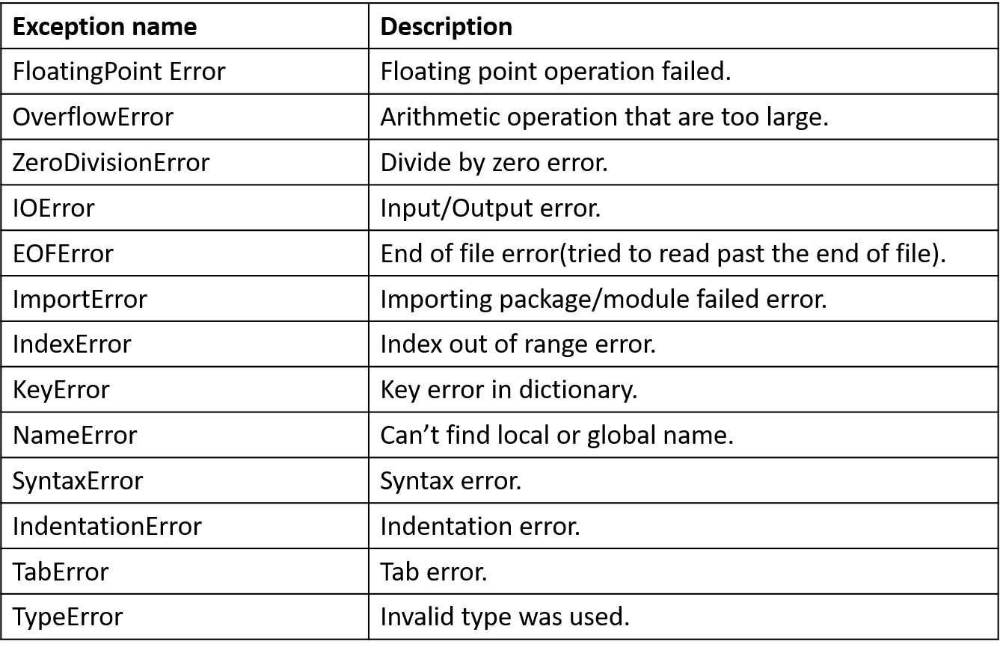

#BASICS-IN-PYTHON-PROGRAMMING
------------------------------

  1. An Introduction
  -------------------
Python is an interpreted, high-level, general-purpose programming language. Created by Guido van Rossum and first released in 1991.
Python has a design philosophy that emphasizes code readability, notably using significant whitespace.
It provides constructs that enable clear programming on both small and large scales.
It is open source software, well documented and vast community to support you. Python is well used in the following fields,
		
	Machine Learning and AI,
	Developing GUI apps,
	Games and 3D graphics,
	Scientific and Numerics,
	Used as scripting language and go on.

It has vast libraries and packages that will help you in anywhere, few notable libraries in python are,

	Data Science - Numpy,NLTK,Matplotlib,scipy,pandas, etc,
	Web Scrapping - Scrapy, Beautiful soup, etc,
	GUI Development -PyQT,Kivy, etc.
  	
  2. Basic Elements in Python
  -----------------------------
    2.1. Variables, Identifiers and Keywords
    ----------------------------------------
  		2.1.1. Variables:
  		-----------------
  		   - Variables are reserved locations in a computer memory to store values.
  		   - we can store data type such as integer,strings,list, etc in a variable.
  		   - variables are stored in stack and their values are stored in heap.
  		   - It does have value,scope,type,scope, etc.
  		   - Python supports Dynamic Typing i.e. Dynamic memory allocation.(Hope you know about stack and heap)

  		    e.g:
  		    		a=10;
  		    		list1=[4,5,3,2,1]
  		    		dic1={1:'jagan',2:'nathan'}
  		    	Here, a,list1,dic1 are variables which holds some values.

  		2.1.2. Identifiers:
  		-------------------
  			- Identifier is the name given to entities like variables,functions,objects etc.
  			- The name of the variable is an identifier.
  			- It doesn't have value,scope,type,scope, etc.

  			Rules for identifier

  				- Case sensitive,
  				- Only Number,letters and underscore is allowed rest of the keywords are not allowed.
  		
  		2.1.3. Keywords:
  		----------------
  			- Keywords are predefined names used as syntax for certain function, loops.
  			- Keywords can't be used in any other ways, otherwise it's a error.

  			e.g:
  					function a:
  						...
  						if ():
  							...
  						...

  				function,if,else,while,for class int,list,tuple,in are some of the keywords in python.

  	2.2. Data Types and Data Structure
  	-----------------------------------
  		The data types in python is given in the below picture. Since python supports dynamic typing, we don't have to
  		initialize any variable. Based on the type of object assigned to the variable, python itself declare the object.

		
		Further, based on the mutablility, data types are further classified as following.
			- The Object are able to modify even after the creation, such object is said to be mutable object.
			- The Object are not able to modify once it's created, such object is said to be immutable object.

		2.2.1. Numeric Data types:
		------------------------
			- In python, based on the value of number python will assign the varible and allocate the memory for various numeric data type such as int, float and complex.

			e.g:

					a=4
					b=34244.53423478
					c=4+5j

				Here a is a int, b is a float, c is a complex numeric data types

		2.2.2. Strings
		-------------
			- String is a sequence of charecters. It is enclosed in single quotes ('') or double quotes("").
			- Python allows Indexing for the srings. Indexing is the process of accessing each charecter or elemet by their index.

			e.g:

					a="earth"
					b="""earth's climate is "hotter" than the sun""" #quotes can be used inside string(when enclosed by triple quotes)
					print(a[2])  #will print letter "r" in variable a

			2.2.2.1. String manipulation:
			--------------------------
			2.2.2.1.1. string concordination(+):
			----------------------------------
				- It is the process of adding one string to another.
				-  '+' is used for concordination.

				e.g:
					a="jagan"
					b="nathan"
					c=a+b
					print (c)  # will give "jagannathan"
			2.2.2.1.2. string Repetition(*):
			-------------------------------
				- It is the process of repeting the strings.
				-  '*' is used for repetition.

				e.g:
					a="jagan"
					b=a*2
					print (b)  # will give "jaganjagan"

			2.2.2.1.3. string formating:
			-------------------------------
				- It is the way to format the string using .format().
				- plcae holders {} are used to fetch respective component. Numbering the place holder is optional. It starts with {0},{1},..
				-  Place holder format:  {[Position]:[Width].[precision][type]}
						position  - position of the placeholder
						width     - how many minimum space needed
						precision - how many digits to retail
						type      - integer(d),float(f),string(s),hexadecimal(x),fixed point decimal(f),percentage(%)
					-If the precision is higher than input then it will do padding(adds the digit (12300000000...)).

				e.g:
					a=23456.7890123
					print("val 1={0:2.2f},\t val 2={1:.8f}".format(a,a))   #val 1=23456.79,  val 2=23456.7890123000

			2.2.2.2. Commonly used methods in strings:
			----------------------------------------
				- Since string is immutable object, most of the methods in string returns a value without altering the original variable.
				- Some of the commonly used methods are,

					2.2.2.2.1. capitalize():
					----------------------
						- This method will capitalize first letter of the given string.
						-  syntax:    <string_var_name>.capitalize()

						e.g:
							a="we loves python"
							b=a.capitalize()
							print(b)  # gives "We loves python"

					2.2.2.2.2. upper():
					----------------------
						- This method will convert all the elements into upper case.
						-  syntax:    <string_var_name>.upper()

						e.g:
							a="we loves python"
							b=a.upper()
							print(b)  # gives "WE LOVES PYTHON"

					2.2.2.2.3. lower():
					----------------------
						- This method will convert all the elements into lower case.
						-  syntax:    <string_var_name>.lower()

						e.g:
							a="We Loves PYTHON"
							b=a.upper()
							print(b)  # gives "we loves python"

					2.2.2.2.4. title():
					----------------------
						- This method will convert given string into title case.
						-  syntax:    <string_var_name>.title()

						e.g:
							a="We loves pYTHON"
							b=a.upper()
							print(b)  # gives "We Loves Python"

					2.2.2.2.5. count("string",start_index,ending_index):
					--------------------------------------------------
						- This method will return the count of occurance of a string in the given string provided starting and ending index.

						-  syntax:    <string_var_name>.count("string",start_index,ending_index)

						e.g:
							a="my name is my pYTHON"
							b=a.count("my")        # b=2
							c=a.count("my",0,20)   # c=2
							d=a.count("my",5,20)   # d=1
							print(b,c,d)           # gives 2,2,1

					2.2.2.2.6. swapcase():
					--------------------
						- This method will return the string by swaping the case of the input string.
						-  syntax:    <string_var_name>.swapcase()

						e.g:
							a="jAGAN1234"
							b=a.swapcase()        # "Jagan1234"
							print(b)           

					2.2.2.2.7. index("string",start_index,ending_index):
					------------------------------------------------
						- This method will return lowest index of a string in the given string provided between starting and ending index.
						- If it doesn't find the index, it will throw error.
						-  syntax:    <string_var_name>.index("string",start_index,ending_index)

						e.g:
							a="my name is pYTHON"
							b=a.index("my")        # b=0
							c=a.index("my",0,20)   # c=0
							d=a.index("my",5,20)   # error
							print(b,c,d)           # gives 0,0,(error)

					2.2.2.2.8. isdigit():
					------------------------------------------------
						- This method will check whether the given string has digits or not.
						- It doesn't check for other language numbers.
						- It will return
								True - if all elements are digits (0-9).
								False - if it has one or more non-digits.
						-  syntax:    <string_var_name>.isdigit()

						e.g:
							a="jagan123"
							b="123456"
							c="三1234"   #  "三" is three in chinese
							d=a.isdigit()        # False
							e=b.isdigit()        # True
							f=c.isdigit()        # False
							print(d,e,f)           # gives False, True, False

					2.2.2.2.9. isnumeric():
					------------------------------------------------
						- This method will check whether the given string has digits or not.
						- It will check for other language number as well
						- It will return
								True - if all elements are digits (0-9).
								False - if it has one or more non-digits.
						-  syntax:    <string_var_name>.isnumeric()

						e.g:
							a="jagan123"
							b="123456"
							c="三1234"   #  "三" is three in chinese
							d=a.isdigit()        # False
							e=b.isdigit()   # True
							f=c.isdigit()        # False
							print(d,e,f)           # gives False, True, True
					
					2.2.2.2.10. isalpha():
					--------------------
						- This method will check whether the given string has alphabets or not.
						- It will return
								True - if all elements are alphabets (a-z,A-Z).
								False - if it has one or more digits.
						-  syntax:    <string_var_name>.isalpha()

						e.g:
							a="jagan123"
							b="jagan"
							c=a.isalpha()        # False
							d=b.isalpha()   	 # True
							print(c,d)           # gives False, True

					2.2.2.2.11. isalnum():
					--------------------
						- This method will check whether the given string has digits and alphabets.
						- It will return
								True - if all elements are digits or alphabets (0-9,a-z,A-Z).
								False - if it has one or more non-digits and non-alphabets.
						-  syntax:    <string_var_name>.isalnum()

						e.g:
							a="jagan123"
							b="jagan_55"         # "_" is non-digit and non-alphabet
							c=a.isalnum()        # True
							d=b.isalnum()	     # False
							print(c,d)           # gives True, False

					2.2.2.2.12. islower():
					--------------------
						- This method will check whether the given string has alphabets which are lower case (digits are allowed).
						- It will return
								True - if all alphabets are lower case (a-z).
								False - if it has one or more non-lower case alphabets.
						-  syntax:    <string_var_name>.islower()

						e.g:
							a="jagan123"
							b="Jagan"
							c=a.islower()        # True
							d=b.islower()	     # False
							print(c,d)           # gives True, False

					2.2.2.2.13. isupper():
					--------------------
						- This method will check whether the given string has all alphabets which are upper case (digits are allowed).
						- It will return
								True - if all elements are upper case (A-Z).
								False - if it has one or more non-upper case alphabets.
						-  syntax:    <string_var_name>.isupper()

						e.g:
							a="JAGAN123"
							b="Jagan"
							c=a.islower()        # True
							d=b.islower()	     # False
							print(c,d)           # gives True, False

					2.2.2.2.14. max(string,*iterables):
					---------------------------------
						- This method will return the maximum item from the given string/list.
						- It will return maximum from string as per it's ASCII value
						-  syntax:    max(string,*iterables)

						e.g:
							a=[1,2,3,4,5]
							b="Zzxyabcde"
							c=max(a)    		#5
							d=max(b)    		#z as per ASCII table   
							print(c,d)  		#5, z

					2.2.2.2.15. min(string,*iterables):
					---------------------------------
						- This method will return the minimum item from the given string/list.
						- It will return minimum from string as per it's ASCII value
						-  syntax:    min(string,*iterables)

						e.g:
							a=[1,2,3,4,5]
							b="Zzxyabcde"
							c=min(a)    		#5
							d=min(b)    		#Z as per ASCII table   
							print(c,d)  		#5, Z

					2.2.2.2.15. split(delimiter):
					---------------------------
						- This method will split the given string into list as per the given delimiter and number of times the split will happen.
						-  syntax:    <string>.split(delimiter,number_of_times_split_to_happen)

						e.g:
							a="9-8-7-6-5-4-3-2-1-0"
							c=a.split('-')    		#split all the elements
							d=a.split('-',5)    	#split happen for 5 times only
							print(c,d)  			#['9','8','7','6','5','4','3','2','1','0'],['9','8','7','6','5','4-3-2-1-0']

					2.2.2.2.16. join(string):
					-----------------------
						- This method will join the given list(all element must be string) or string into a string with delimiter in it.
						-  syntax:    <delimiter>.join(string/list)

						e.g:
							a=['9','8','7','6','5','4','3','2','1','0']
							b="9876543210"
							c='-'.join(a)    		#"9-8-7-6-5-4-3-2-1-0"
							d='-'.join(b)           #"9-8-7-6-5-4-3-2-1-0"
							print(c,d)  

					2.2.2.2.17. strip(<charecter>):
					---------------------------
						- This method will remove all leading and trailing charecter only as specified in argument.
						- syntax:    <string>.strip(<charecter>)

						e.g:
							a="--98765--43210--"
							b=a.strip('-')    		#"98765--43210"
							print(b)  

					2.2.2.2.18. lstrip(delimiter):
					---------------------------
						- This method will remove all leading charecter only as specified in argument.
						- syntax:    <string>.lstrip(<charecter>)

						e.g:
							a="--98765--43210--"
							b=a.lstrip('-')    		#"98765--43210--"
							print(b)  

					2.2.2.2.19. rstrip(delimiter):
					---------------------------
						- This method will remove all trailing charecter only as specified in argument.
						- syntax:    <string>.rstrip(<charecter>)

						e.g:
							a="--98765--43210--"
							b=a.strip('-')    		#"--98765--43210"
							print(b)  

					2.2.2.2.20. len(string):
					----------------------
						- This method will return the length of the string.
						- syntax:    len(string)

						e.g:
							a="9876543210"
							b=len(a)    		#10
							print(b)  	

					2.2.2.2.21. find("string",start_index,ending_index):
					------------------------------------------------------
						- This method will return lowest index of a string in the given string provided between starting and ending index.
						- If it doesn't find the index, it will return -1.
						-  syntax:    <string_var_name>.find("string",start_index,ending_index)

						e.g:
							a="my name is my pYTHON"
							b=a.find("my")        # b=0
							c=a.find("my",0,20)   # c=0
							d=a.find("my",5,20)   # d=11
							print(b,c,d)           # gives 0,0,11

					2.2.2.2.22. replace(old,new,number_of_times_to_replace):
					---------------------------------------------------------
						- This method will return lowest index of a string in the given string provided between starting and ending index.
						- If it doesn't find the charecter, it won't replace but it will simply return the string.
						-  syntax:    <string_var_name>.replace(old,new,number_of_times_to_replace)

						e.g:
							a="python is best. python is awesome"
							b=a.replace('p','P')          # "Python is best. Python is awesome"
							c=a.replace('p','P',1)        # "Python is best. python is awesome"
							print(b,"\n",c)           

					2.2.2.2.23. rfind("string",start_index,ending_index):
					-------------------------------------------------------
						- This method will return highest index of a string in the given string provided between starting and ending index (it's a kind of finding the string from reverse).
						- If it doesn't find the index, it will return -1.
						-  syntax:    <string_var_name>.find("string",start_index,ending_index)

						e.g:
							a="my name is my pYTHON"
							b=a.rfind("my")        # b=11
							c=a.rfind("my",0,20)   # c=11
							d=a.find("my",5,20)    # d=11
							print(b,c,d)           # gives 11,11,11

					2.2.2.2.24. rindex("string",start_index,ending_index):
					------------------------------------------------------
						- This method will return highest index of a string in the given string provided between starting and ending index (it's a kind of finding the string from reverse).
						- If it doesn't find the index, it will through error.
						-  syntax:    <string_var_name>.rindex("string",start_index,ending_index)

						e.g:
							a="my name is pYTHON"
							b=a.rindex("my")        # b=0
							c=a.rindex("my",0,20)   # c=0
							d=a.rindex("my",5,20)    # d=error
							print(b,c,d)           # gives 0,0,error

		2.2.3. LIST:
		----------
			- Lists (also array in some language) in python is declared by enclosing the elemnts inside "[]".
			- Lists can hold mutiple datatypes inside it and it also supports multidimension lists.
			- As we know python is dynamic typing language, it is not necessary to mention the size of a list.

			e.g:

				a=[]  									# to create empty list
				b=[1,2,4,"jagan",{1:20,2:30}] 			# list contains different datatypes
				c=[1,2,[3,4,[5,6,7]],8,9]				# multi dimensional list

			2.2.3.1. LIST METHODS:
			--------------------

				2.2.3.1.1. list(<string/tuple/dictionary>)
				----------------------------------------
					- List is a mutable object.
					- this method will convert the given string/tuple/dictionary into list.
					- for dictionary, only key values are taken and formed as list.
					- syntax: list(<string/tuple/dictionary>)	
					e.g:
						a="jagan"
						b=('j','a',66,'g')
						c={1:10,2:20,3:30,'j':40}
						x=list(a)              # ['j', 'a', 'g', 'a', 'n'] 
						y=list(b)              # ['j', 'a', 66 , 'g'] 
						z=list(c)              # [1, 2, 3,'j']
						print (x,y,z)

				2.2.3.1.2. len(<list>)
				----------------------------------------
					- this method will return the number of element present in the list.
					- syntax: len(<list>)	
					e.g:
						a=[1,2,3,4,"python",34,[3,5,6]]
						b=len(a)              # 7 
						print (b)

				2.2.3.1.3. min(<list>)
				--------------------
					- this method will return the minimum element in the list.
					- All the elements in the list must be of same datatype.
					- syntax: min(<list>)	
					e.g:
						a=['p','y','t','h','o','n']
						b=[1,2,3,4,5,6]
						x=min(a)              # 'h' 
						y=min(b)              #  1
						print (x,y)

				2.2.3.1.4. max(<list>)
				--------------------
					- this method will return the maximum element in the list.
					- All the elements in the list must be of same datatype.
					- syntax: max(<list>)	
					e.g:
						a=['p','y','t','h','o','n']
						b=[1,2,3,4,5,6]
						x=max(a)              # 'y' 
						y=max(b)              #  6
						print (x,y)

				2.2.3.1.5. append(<element>)
				----------------------------------------
					- this method will append the element at the end of list.
					- The elements are added as last element, it won't check for duplication. whatever passed as argument it will add to the list.
					- syntax: <list>.append(<element>)	

					e.g:
						a=[1,2,3]
						a.append(4)  				# [1,2,3,4]
						a.append([5,6,7])			# [1,2,3,4,[5,6,7]]
						a.append("jagan")			# [1,2,3,4,[5,6,7],"jagan"]
						a.append({1:50,2:100})		# [1,2,3,4,[5,6,7],"jagan",{1:50,2:100}]
						print (a)

				2.2.3.1.6. extend(<list>)
				----------------------------------------
					- this method will extend one list with another list.
					- syntax: <list1>.extend(<list2>)	
					e.g:
						a=[1,2,3]
						b=[4,5,"jagan"]
						a.extend(b)		# [1,2,3,4,5,"jagan"]
						print (a)

				2.2.3.1.7. insert(<index>,<element>)
				----------------------------------------
					- this method will insert the given element in given position into the list.
					- If the index went out of bound, then the element is appended at the end.
					- syntax: <list1>.insert(<index>,<element>)	
					e.g:
						a=[1,2,3,4,5,6]
						a.insert(3,0)    # [1,2,3,0,4,5,6]
						a.insert(10,7)	 # [1,2,3,0,4,5,6,7]
						print (a)

				2.2.3.1.8. remove(<element>)
				----------------------------------------
					- this method will remove the given element from the list from index 0 to n. (It will do for only once).
					- syntax: <list1>.remove(<element>)	
					e.g:
						a=[1,2,1,2,3]
						a.remove(1)  #[2,1,2,3]
						print (a)

				2.2.3.1.9. pop(<position>)
				----------------------------------------
					- this method will pop out the element from the given position.
					- the element is removed from the original list and returned.
					- If the index is not found, it will throw error
					- syntax: <list1>.pop(<position>)	
					e.g:
						a=[1,2,3,4,5]
						b=a.pop(2)		# a=[1,2,4,5]
						print (b)       # 3

				2.2.3.1.10. index(<element>)
				----------------------------------------
					- this method will return index of first occurance of the given element.
					- If the element is not found, it will throw error.
					- syntax: <list1>.index(<element>)	
					e.g:
						a=[1,2,1,2,3,4]
						b=a.index(2)		# index posisiton 1
						print (b)           #  b=1

				2.2.3.1.11. count(<element>)
				----------------------------------------
					- this method will return number of occurance of the given element in a list.
					- If the element is not found, it return zero.
					- syntax: <list1>.count(<element>)	

					e.g:
						a=[1,2,1,2,2,3,4,2]
						b=a.count(2)		# b=4
						print (b)           

				2.2.3.1.12. sort(<key>,<reverse=True/False>)
				----------------------------------------
					- this method will sort the elements in the list, by default it will sort by ascending order.
					- If the reverse=True, it will sort in reverse order.
					- syntax: <list1>.sort(<key>,<reverse=True/False>)	
					e.g:
						a=[2,3,4,2,1,5,8]
						a.sort()		# sort in ascending order
						print (a)           #  [1, 2, 2, 3, 4, 5, 8]
						a.sort(reverse=True)		# sort in decending order
						print (a)           #  [8, 5, 4, 3, 2, 2, 1]

				2.2.3.1.13. reverse()
				-------------------
					- this method will simply reverse the list without sorting it.
					- syntax: <list1>.reverse()	
					e.g:
						a=[2,3,4,2,1,5,8]
						a.reverse()
						print (b)           #  [8, 5, 1, 2, 4, 3, 2]

				2.2.3.1.14. copy()
				----------------
					- this method will do complete copy of the list and returns it.
					- syntax: <list1>.copy()	
					e.g:
						a=[2,3,4,2,1,5,8]
						b=a.copy()			# b=[2,3,4,2,1,5,8]
						a.clear()      		#  empty list []
						print (b,a)			# [2,3,4,2,1,5,8] , []

				2.2.3.1.14. clear()
				----------------------------------------
					- this method will clear all the elements in a list.
					- syntax: <list1>.clear()	
					e.g:
						a=[2,3,4,2,1,5,8]
						a.clear()      		#  empty list []
						print (a)			#  []

			2.2.3.2. LIST SLICING
			--------------------
				- It is the process of extracting the specific elements from the list.
				- In python we have two type of indexing,
					
					1) Positive indexing starts from left to right with 0,1,2,3,...
					2) Negative indexing starts from right to left with -1,-2,-3,...
				
				- In slicing, positive and negative indexing can be used seperately or combining both.

				- syntax : <list>	[start_index:end_index:step_size]
					default values is,
							start_index=0
							end_index= till last element(i.e. -1)
							step_size=1

				- Note: end_index is exlusive limit (i.e. (end_index-1))

				e.g:
					a=[1,2,3,"jagan",[4,5,[6,7,8]],9,10]
					print(a[::])        #[1, 2, 3, 'jagan', [4, 5, [6, 7, 8]], 9, 10]
					print(a[::-1])      #reversed [10, 9, [4, 5, [6, 7, 8]], 'jagan', 3, 2, 1]
					print(a[::-2])      # [10, [4, 5, [6, 7, 8]], 3, 1]
					print(a[::2])       #[1, 3, [4, 5, [6, 7, 8]], 10]
					print (a[:3])       #[1, 2, 3]
					print (a[3][:3])    #'jag'
					print(a[4][2])      #[6,7,8]
					print (a[:-3:-1])   #[10, 9]
					print (a[:2:-1])   #[10, 9, [4, 5, [6, 7, 8]], 'jagan']

		2.2.4. TUPLES:
		--------------
			- Tuple is consist of sequence of elements which may contain different datatypes.
			- It is immutable object object. Most of it's operation is similar to list.
			- Indexing/slicing is similar to list.
			- It can be used in a function as return value thus it will return multiple values(since function can return single value only).

			e.g:

				a=()  		   # to create empty empty typle
				b=(5)  		   # it is not a tuple, it is a integer.
			  - To create tuple with single value, we need to add ',' after single value
				b=(5,)         # it is a tuple	
				c=(5,4,3,2,1)

			- It is not as flexible as list. It has less built in methods compared to list.

			2.2.4.1.Tuple Methods:
			--------------------
				2.2.4.1.1 tuple(<string/list/dictionary>)
				----------------------------------------
					- this method will convert the given string/list/dictionary into tuple.
					- for dictionary, only key values are taken and formed as list.
					- syntax: tuple(<string/list/dictionary>)	

					e.g:
						a="jagan"
						b=['j','a',66,'g']
						c={1:10,2:20,3:30,'j':40}
						x=tuple(a)              # ('j', 'a', 'g', 'a', 'n')
						y=tuple(b)              # ('j', 'a', 66 , 'g')
						z=tuple(c)              # (1, 2, 3,'j')
						print (x,y,z)

				2.2.4.1.2. count(<element>)
				---------------------------
					- this method will return number of occurance of the given element in a tuple.
					- If the element is not found, it return zero.
					- syntax: <tuple>.count(<element>)	

					e.g:
						a=(1,2,1,2,2,3,4,2)
						b=a.count(2)		# b=4
						print (b)           

				2.2.4.1.3. index(<element>)
				--------------------------
					- this method will return index of first occurance of the given element.
					- If the element is not found, it will throw error.
					- syntax: <tuple>.index(<element>)	
					e.g:
						a=(1,2,1,2,3,4)
						b=a.index(2)		# index posisiton 1
						print (b)           #  b=1

				2.2.4.1.4. len(<tuple>)
				----------------------------------------
					- this method will return the number of element present in the tuple.
					- syntax: len(<tuple>)	
					e.g:
						a=(1,2,3,4,"python",34,[3,5,6])
						b=len(a)              # 7 
						print (b)

				2.2.4.1.5. min(<tuple>)
				---------------------
					- this method will return the minimum element in the tuple.
					- All the elements in the tuple must be of same datatype.
					- syntax: min(<tuple>)	
					e.g:
						a=('p','y','t','h','o','n')
						b=(1,2,3,4,5,6)
						x=min(a)              # 'h' 
						y=min(b)              #  1
						print (x,y)

				2.2.4.1.6. max(<tuple>)
				--------------------
					- this method will return the maximum element in the tuple.
					- All the elements in the tuple must be of same datatype.
					- syntax: max(<tuple>)	
					e.g:
						a=('p','y','t','h','o','n')
						b=(1,2,3,4,5,6)
						x=max(a)              # 'y' 
						y=max(b)              #  6
						print (x,y)

				2.2.4.1.7. reversed(<tuple>)
				---------------------------
					- tuple don't have reverse() unlike list.
					- this method will simply reverse the tuple without sorting it as a object (not as a tuple).
					- syntax: reversed(<tuple>)	
					e.g:
						a=2,3,4,2,1,5,8)
						b=reversed(a)
						print (b)           #  object containing (8, 5, 1, 2, 4, 3, 2)

		2.2.5. DICTIONARY:
		----------------
			- It is an unordered collection of items.
			- Each item in a dictionary has a key and each key is associated with a value.
			- It doesn't have any order hence it doesn't have index.
			- Items are referred as keys.
			- syntax {key1:value1,key2:value2,....}
			- To add an item into the dictionary,
					dict_name[key]	= value
			- To delete an item to the dictionary,
					del dict_name[key]

			
			e.g:
				dict1={}  									 # empty dictionary
				dict2={'A':10,'B':20,'C':30,'D':40,'E':50}   # A,B,C,D,E are keys & 10,20,30,40,50 are values.
				print(dict2['C'])   						 # to get value for the key 'C'
				dict2['C']=25								 # to assign the value for the key 'C'
				print (dict2)								 # {'A': 10, 'B': 20, 'C': 25, 'D': 40, 'E': 50}
				dict2['F']=60								 # to add a new key and the value
				print (dict2)								 # {'A': 10, 'B': 20, 'C': 25, 'D': 40, 'E': 50, 'F': 60}
				del dict2['F']								 # Delete an item from dictionary
				print (dict2)								 # {'A': 10, 'B': 20, 'C': 25, 'D': 40, 'E': 50}

			2.2.5.1. Dictionary Methods
			--------------------------
				2.2.5.1.1. len(<dict>)
				----------------------------------------
					- this method will return the number of element(as keys) present in the dictionary.
					- syntax: len(<dict>)	
					e.g:
						a={'A':10,'B':20,'C':30,'D':40,'E':50}
						b=len(a)              # 5 
						print (b)

				2.2.5.1.2. str(<dict>)
				---------------------
					- this method will convert the dictionary into string.
					- this will convert the charecter including {,',: as str.
					- syntax: str(<dict>)	
					e.g:
						a={'A':10,'B':20,'C':30,'D':40,'E':50}
						b=str(a)              # 5 
						print (b)			  # "{'A' : 10, 'B' : 20, 'C' : 30, 'D' : 40, 'E' : 50}"  it adds space as well.

				2.2.5.1.3. clear()
				----------------
					- this method will clear all the entry from dictionary.
					- syntax: <dict>.clear()	
					e.g:
						a={'A':10,'B':20,'C':30,'D':40,'E':50}
						a.clear()              					# It will clear all the elements.
						print (a)			  					# empty dict

				2.2.5.1.4. copy()
				----------------
					- this method will deep copy the complete dictionary.
					- syntax: <dict>.copy()	
					e.g:
						a={'A':10,'B':20,'C':30,'D':40,'E':50}
						b=a.copy()            # b={'A':10,'B':20,'C':30,'D':40,'E':50}
						a.clear()			  # a={}	
						print(a) 			  
						print (b)			  # b={'A':10,'B':20,'C':30,'D':40,'E':50}

				
				2.2.5.1.5. get(<key>,default=None)
				----------------------------------------
					- this method will return the value for given key value.
					- If the key is not found, it will return None. If needed we can modify the error message from default statement.
					- It is similar to <dict>[key].(If key value not found, it will show error)
					- syntax: <dict>.get(<key>,default=None)

					e.g:
						a={'A':10,'B':20,'C':30,'D':40,'E':50}
						b=a.get('C')	# get the value for key 'C'
						c=a['C']        # another way 
						d=a.get('J')    # return None
						e=a['J']        # return error
						f=a.get('J',"key not found")    # return specific msg
						print (b,"\n",c,"\n",d,"\n",e,"\n",f)

				2.2.5.1.6. keys()
				----------------
					- this method will return the all the keys from the dictionary as a dict_keys which doesn't support indexing.
					- This dict_keys is further converted into list using list().
					- syntax: <dict>.keys()

					e.g:
						a={'A':10,'B':20,'C':30,'D':40,'E':50}
						b=a.keys()
						print (type(b))                   # <class 'dict_keys'>
						c=list(a.keys())                  
						print(type(c))                    # <class 'list'>
						print(c[1])                       # 'B'

				2.2.5.1.7. values()
				----------------
					- this method will return the all the values from the dictionary as a dict_values which doesn't support indexing.
					- This dict_values is further converted into list using list().
					- syntax: <dict>.values()

					e.g:
						a={'A':10,'B':20,'C':30,'D':40,'E':50}
						b=a.values()
						print (type(b))                   # <class 'dict_keys'>
						c=list(a.values())                  
						print(type(c))                    # <class 'list'>
						print(c[1])                       # 20

				2.2.5.1.8. items()
				----------------
					- this method will return the all the keys and values from the dictionary as a dict_items which doesn't support indexing.
					- This dict_items is further converted into list using list() function.
					- After list function, the output is a list containg seperate tuples which has each key and it's value.
					- syntax: <dict>.items()

					e.g:
						a={'A':10,'B':20,'C':30,'D':40,'E':50}
						b=a.items()
						print (type(b))           # <class 'dict_items'>
						c=list(a.items())
						print(c)                  # [('A', 10), ('B', 20), ('C', 30), ('D', 40), ('E', 50)]
						print (c[1])              # ('B', 20)
						print(type(c[1]))         # <class 'tuple'>

					2.2.5.1.8.1. Looping through key and values parallely.
					----------------------------------------------------
						- we can loop through key and values parallely by simple using for loop.

						e.g:

							for i,j in a.items():
    							print (i,"=",j);  		# print each key and values

				2.2.5.1.9. has_key(<key>) (only until python 2.6 version, removed in python 3.x)
				-----------------------------------------------------------------------------
					- this method will check whether the given key is present or not.
					- return True if key is found, else return false.
					- syntax: <dict>.has_key(<key>)

					e.g:
						a={'A':10,'B':20,'C':30,'D':40,'E':50}
						b=a.has_key('Z')			  # python 2.x
						c=a.has_key('C')			  # python 2.x
						d='E' in a      			  # python 3.x
						print (b,c)                   # False, True
						
					- For python 3.x versions, we can use 'in' keyword to check whether the given key is present or not. 

				2.2.5.1.10. pop(<key>)
				--------------------
					- this method will pop the value for given key from dictionary.
					- if key is not found, will show error.
					- syntax: <dict>.pop(<key>)

					e.g:
						a={'A':10,'B':20,'C':30,'D':40,'E':50}
						b=a.pop('C')
						print(b)            # '30'
						print(a)            # {'A': 10, 'B': 20, 'D': 40, 'E': 50}

				2.2.5.1.11. update(<dict2>)
				--------------------------
					- this method will update/merge one dictionary with another.
					- If the same key found on both dictionary, then it will update the new key value(i.e. from dict2). 
					- syntax: <dict1>.update(<dict2>)

					e.g:
						a={'A':10,'B':20,'C':30,'D':40,'E':50}
						b={'A':80,'B':90,'F':60,'G':70}
						a.update(b)
						print(b)            # {'A': 80, 'B': 90, 'F': 60, 'G': 70}
						print(a)            # {'A': 80, 'B': 90, 'C': 30, 'D': 40, 'E': 50, 'F': 60, 'G': 70}

	2.3. Commonly used built-in Methods:
	------------------------------------					
		- Here we will see some of the commonly used methods.

		2.3.1. abs(<value>)				
		--------------------
			- This method will return the absolute value (i.e. only positive results) of given integer.
			- syntax:  abs(<value>)
			e.g:
				a=-101.56
				b=abs(a)
				print(b)		#101.56

		2.3.2. bin(<value>)				
		--------------------
			- This method will covert integer(non-float values) into binary values.
			- syntax:  bin(<value>)
			e.g:
				a=10
				b=-101
				print(bin(a))           # 0b1010
				print(bin(b))           # -0b1100101

		2.3.3. chr(<value>)				
		-------------------
			- This method will convert integer(convertable integer) into charecter.
			- syntax: chr(<value)
			e.g:
				a=chr(10)				# '10'
				print(type(a))			
				b=chr(-101)  			# error '-'
				print(type(b))
				c=chr(101.5)			# error decimal value
				print(type(c))           
				d=chr(4/5)				# error '/'
				print(type(d))           

		2.3.4. complex (<real>,<imaginary>)				
		-----------------------------------
			- This method will create the  complex number given that real and imaginary values.
			- syntax: complex(<real>,<imaginary>)
			e.g:
				a=complex(2,-3)
				b=complex(-5,9)
				print(a,b)				# (2-3j) (-5+9j)

		2.3.5. delattr(<object>,<attribute_name>)				
		-----------------------------------------
			- This method is used to delete an atttribute from the object given both as argument.
			- syntax: delattr(<object>,<attribute_name>)
			e.g:
				class coordinate:
				    x=10
				    y=5
				    z=2

				print(coordinate.z)   # 2
				#del coordinate.z     # del coordinate.z   -> can also be used
				delattr(coordinate,'z')  
				print(coordinate.z)   # error bcz attribute deleted

		2.3.6. dir(<object>)				
		-----------------------------------
			- This method will return the long list containing attributes of the class.
			- syntax: dir(<object>)
			e.g:
				class coordinate:
				    x=10
				    y=5
				    z=2

				print(dir(coordinate))  # gives long list of attributes for the class

		2.3.7. enumerate(<iterable>,<start=0>)				
		--------------------------------------
			- This method will adds counter to an iterable and returns it in tuple format (as a object).
			- syntax: enumerate(<iterable>,<start=0>)
			e.g:
				a=[2,4,6,8]

				for i in enumerate(a,0):
				    print (i);  			# (0, 2) (1, 4) (2, 6) (3, 8)

				for i in enumerate(a,22):
				    print (i);  			# (22, 2) (23, 4) (24, 6) (25, 8)

		2.3.8. getattr(<object>,<attribute_name>)				
		-----------------------------------------
			- This method is used to return value of an atttribute from the object given both as argument.
			- syntax: getattr(<object>,<attribute_name>)
			e.g:
				class coordinate:
				    x=10
				    y=5
				    z=2

				b=getattr(coordinate,'y')
				print(b)					# 5
				

		2.3.9. hasattr(<object>,<attribute_name>)				
		-----------------------------------------
			- This method is used to check whether the given attribute is present or not in the object.
			- Return True, if attribute found, else return False.
			- syntax: hasattr(<object>,<attribute_name>)
			e.g:
				class coordinate:
				    x=10
				    y=5
				    z=2

				b=hasattr(coordinate,'y')
				print(b)					# True
				c=hasattr(coordinate,'p')
				print(c)					# False

		2.3.10. setattr(<object>,<attribute_name>)				
		-----------------------------------------
			- This method is used to set value for the given attribute in the object.
			- If the attribute is not present, then this function will create the attribute and set the value.
			- syntax: setattr(<object>,<attribute_name>,<attribute_value>)
			e.g:
				class coordinate:
				    x=10
				    z=2
				print(coordinate.x)					# x=10
				setattr(coordinate,'x',5)			
				print(coordinate.x)					# x=5
				setattr(coordinate,'y',3)			# create y and set y=3
				print(coordinate.y)					# y=3
				
		
		2.3.11. hex(<integer>)				
		---------------------
			- This method will convert an integer (non-float values) into hexadecimal value.
			- syntax: hex(<integer>)
			e.g:
				a=hex(435)					# 0x1b3
				b=hex(0)					# 0x0
				c=hex(-34)					# -0x22
				d=hex(20.55)				# error
				print(a,b,c)  				# 0x1b3 0x0 -0x22

		2.3.12. oct(<integer>)				
		---------------------
			- This method will convert an integer (non-float values) into octal value.
			- syntax: oct(<integer>)
			e.g:
				a=oct(435)					# 0o663
				b=oct(0)					# 0o0
				c=oct(-34)					# -0o42
				d=oct(20.55)				# error
				print(a,b,c)  				# 0o663 0o0 -0o42

		2.3.13. int(<string>)				
		---------------------
			- This method will convert an string numeric(0-9, non-float) into integer.
			- syntax: int(<string>)
			e.g:
				a=int('435')                # 435
				b=int('25.67')              # error
				c=int('-34')                # -34
				d=int('pyt-34')             # error
				print(a,c)                  # 435 -34
		
		2.3.14. input(<string>)				
		---------------------
			- This method will get and return input (as a string) from the user (similar to scanf in C).
			- syntax: input(<string>)
			e.g:
				a=input("please press any key")                
				print (a)					# user pressed value (as a string)
		

		2.3.15. iter(<iterable>)				
		------------------------
			- This method will create an object which is iterated one element at a time.
			- string/list/tuples is not an iterator by default, we need to use iter(<iterator>) function for converting string/list/tuples into iterator.
			- syntax: iter(<iterable>)
			e.g:
				a="python"
				x=len(a)
				a=iter(a)   # must 

		2.3.16. next(<iterable>)				
		-------------------------
			- This method will return the next item from the iterable object.
			- string/list/tuples is not an iterator by default, we need to use iter(<iterator>) function for converting string/list/tuples into iterator.
			- if the last iterable reached further doing next() will result in error.
			- syntax: next(<iterable>)
			e.g:
				a="python"
				x=len(a)
				a=iter(a)   # must 
				for i in range(0,x):
				    print (next(a))         # p y t h o n
	

		2.3.17. pow(<val1>,<val2>)				
		-------------------------
			- This method will return val1 to the power of val2.
			- It is same as val1**val2.
			- syntax: pow(<val1>,<val2>)
			e.g:
				a=pow(2,8)
				print(a)  		# 256
				b=2**8
				print(b)		# 256

		2.3.18. range(<start_val>,<stop_val>,<step_size>)				
		-------------------------------------------------
			- This method will iterate the values from given range
			- If start value is not given, then it starts from 0.
			- To go back in negative values, step size must be included and must be negative.
			- Stop_value is exclusive limit (i.e. stop_value-1).
			- syntax: range(<start_val>,<stop_val>,<step_size>)
			
			e.g:
				a=list(range(10))				# [0, 1, 2, 3, 4, 5, 6, 7, 8, 9]
				b=list(range(1,10))				# [1, 2, 3, 4, 5, 6, 7, 8, 9]
				c=list(range(1,10,2))			# [1, 3, 5, 7, 9]
				d=list(range(5,-5))     		# empty list
				e=list(range(5,-5,-1))			# [5, 4, 3, 2, 1, 0, -1, -2, -3, -4]
				print(a,b,c,d,e)

		2.3.19. reversed(<list/tuple/string>)				
		-------------------------------------------------
			- This method will create an object containing reverse of the given iterables without sorting it.
			- syntax: reversed(<list/tuple/string>)
			
			e.g:
				a=[5,4,3,2,1]
				#a="jagan"
				b=reversed(a)                   # object
				c=list(reversed(a))             # list of reversed input
				print(b,c)

		2.3.20. round(<integer>)				
		-------------------------------------------------
			- This method will roundoff the given interger.
			- syntax: round(<integer>)
			
			e.g:
				a=round(5.34)			# 5
				b=round(5/4)			# 1
				c=round(-6.78)			# -7
				print(a,b,c)
				
		2.3.21. slice(<start>,<stop>,<step>)				
		------------------------------------
			- This method will create an slice object containing elements within the specific range.
			- syntax: slice(<start>,<stop>,<step>)
			
			e.g:
				a=[5,4,3,2,1]
				b=slice(3)          # object slice(None, 3, None)
				c=slice(0,4,2)      # object slice(0, 4, 2)
				d=a[b]              # [5, 4, 3]
				e=a[c]              # [5, 3]
				print(d,e)

		2.3.22. reversed(<list/tuple/string>)				
		-------------------------------------------------
			- This method will create an object containing reverse of the given iterables without sorting it.
			- syntax: reversed(<list/tuple/string>)
			
			e.g:
				a=[5,4,3,2,1]
				#a="jagan"
				b=reversed(a)                   # object
				c=list(reversed(a))             # list of reversed input
				print(b,c)
		
		2.3.22. sorted(<iterable>,(<key>,<reverse>))				
		-------------------------------------------------
			- This method will sort an iterable ascending,desending,reverse or as per key function.
			- syntax: sorted(<iterable>,(<key>,<reverse>))
			
			e.g:				
				def key1(elem):
				    return elem[2]

				a=[(1,2,3),(2,3,4),(2,2,1),(3,4,5),(4,5,6)]
				b=sorted(a)
				print(b)                     # [(1, 2, 3), (2, 2, 1), (2, 3, 4), (3, 4, 5), (4, 5, 6)]
				c=sorted(a,reverse=True)     # sort and reverse it
				print(c)                     # [(4, 5, 6), (3, 4, 5), (2, 3, 4), (2, 2, 1), (1, 2, 3)]
				d=sorted(a,key=key1)         # sort as per 3rd element
				print(d)                     # [(2, 2, 1), (1, 2, 3), (2, 3, 4), (3, 4, 5), (4, 5, 6)]

		2.3.23. sum(<iterable>,<additional_value>)				
		------------------------------------------
			- This method will adds the items of iterable and return it's sum.
			- additional_value is optional. If provided, it adds this value to result and returns it.
			- The iterable must be in integer type.
			- syntax: sum(<iterable>,<additional_value>)
			e.g:
				a=[1,2,3,4,5]
				b=sum(a)      # 15
				c=sum(a,3)    # 15+3
				print(b,c)    # 15 18
		
		2.3.24. zip(<iterable1,iterable2,iterable3,>)				
		---------------------------------------------
			- This method will merge the multiple iterables as per their index into a tuples and created into an object.
			- the merge will happen for the iterables having least number of elements. 
			- if the last iterable reached further doing next() will result in error.
			- syntax: zip(<iterable1,iterable2,iterable3,>)
			e.g:
				a=(1,2,3,4)                             # length =4
				b=["terry","drogba","hazard","torres"]  # length =4
				c=(9,10,9)             					# length =3
				e=zip(a,b,c)            				# object alone
				d=list(zip(a,b,c))      				# object converted into list
				print(d)                				# [(1, 'terry', 9), (2, 'drogba', 10), (3, 'hazard', 9)]
			
		2.3.25. print(<string+formatting>)				
		----------------------------------
			- This method will print the given statement along with formatting if given (similar to printf in C).
			- syntax: print(<string+formatting>)
			e.g:
				a=[5,4,3,2,1]
				print("Python is better programming language")          #Python is better programming language
				print("element 1:{4},element 2:{3},element 3:{2},element 4:{1},element 5:{0}".format(a[0],a[1],a[2],a[3],a[4]))  										#element 1:1,element 2:2,element 3:3,element 4:4,element 5:5
	2.4. Conditional statements:
	-----------------------------
			- Python is indendation based programming. so for each hierarchy proper indendation is needed.
			- similar to other programming language python supports 

					- simple if
					- if..else
					- if..elif..else
					- nested if 

			2.4.1. Simple if:
			----------------
				if (condition):    					# bracket is  not mandatory
					statements
					...

				e.g:

					if (3>1):						# bracket is  not mandatory
						print ("Condition True")

			2.4.2. if..else:
			----------------
				if (condition):    					# bracket is  not mandatory
					statements
					...
				else:
					statements
					...

				e.g:
					if (3>4):						# bracket is  not mandatory
						print ("Condition True")
					else:
						print ("Condition False")

			2.4.3. if..elif..else:
			----------------------
				if (condition):    					# bracket is  not mandatory
					statements
					...
				elif (condition):
					statements
					...
				else:
					statements
					...

				e.g-1:
					if (3>4):						# bracket is  not mandatory
						print ("If Condition")
					elif (3>1):
						print ("elif Condition")
					else:
						print("else Condition")
				
				e.g-2
					x=input("Enter the charecter:")  #give some input
					x=x.lower()  #lower all the letters
					if  "dog" in x and  "cat" in x:
					    print("Dog and cat found")
					elif "dog" in  x:
					    print("Dog found")
					elif "cat" in x:
					    print("Cat found")
					else:
					    print("Not finding cat or dog in the string")

	2.5. Looping:
	-------------			
		- Unlike other language python doen't have lot of looping statement. It has only two loop which is enough to perform all tasks. They are

				- for loop
				- while loop
		
		2.5.1. for loop:
		----------------
			- syntax:
			---------
					for i in (iterable):
						statements
						...
						...

			- In python for loop can be used in two ways.

				- for loop, looping through the index of the iterables(uses range function).
				- for loop, looping through the elements of the iterables.

			2.5.1.1. Looping using values/index values.
			-------------------------------------------
				- This method uses the range function which will be used to loop through the iterables.
				- This is very usefull if the looping involves lot of iterables.

				e.g:

					a=(1,2,3,4,5)
					b=["hazard","kepa","rudiger","kovacic","kante"]
					c=(10,1,2,17,7)
					length=len(b)

					for i in range(length):
					    print("s.no:{},name:{},jersey no:{}".format(a[i],b[i],c[i]))	
					    
			2.5.1.2. Looping using element
			------------------------------
				- This method will loop through each elements in the iterables.
				- This is very usefull if the looping involves single iterable.

				e.g:

					a=["hazard","kepa","rudiger","kovacic","kante"]
					j=1
					for i in a:
					    print("{}.player name:{}".format(j,i))				
					    j+=1

		2.5.2. while loop:
		------------------
			- It is similar to while loop in other language. It is used when the limit is unknown.
			- syntax:
			---------
					while (expression):
						statements
						...
						...

			e.g:

					i=0
					while (i<10):
					    print(i)
					    i+=1

	2.6. Functions in python:
	--------------------------
		- Functions is a block of code that perform a specific task.
		- "def" is the keyword used to define a function.
		
		- syntax:
		---------

				def function_name(optional_parameters):
					statements
					...
					...
				
				function_name(optional_parameter)		 		# calling a function

		e.g:

			def add(x,y):
			    return (x+y)

			x=add(5,10)
			print(x)

		2.6.1. Parameter passing in function:
		-------------------------------------
			- similar to many other programming language python supports twokind of parameter passing

					- Pass by value     (For immutable objects)
					- Pass by reference (For mutable objects)

			- Python itself decide the which method is choosed based on the input argument datatypes.

		2.6.2. ordering and default arguments:
		--------------------------------------
			- Python has four kind of argument passing. They are,

				- Positional arguments
				- Keyword arguments
				- Default arguments
				- Variable arguments

			2.6.2.1. Positional arguments:
			------------------------------
				- In this method, the arguments are passed as per their position (Kind of one to one correspondence).

				 e.g:

				 	def add(x,y):
					    return (x+y)

					a=add(5,10)
					print(a)

			2.6.2.2. Keyword arguments:
			------------------------------
				- In this method, the arguments are passed as per their names (keywords).
				- Here, the position may varies but their name is matched.

				 e.g:

				 	def add(x,y):
					   return (x**y)   

					a=add(y=3,x=2)
					print(a)

			2.6.2.3. Default arguments:
			------------------------------
				- This method is used where we need some arguments to have some default values if value is not given for that default argument.
				- if the new argument are passed from function call, then the default value is overridden by new value.

				 e.g:

				 	def add(x,y=1):
					   return (x**y)   

					a=add(x=2)              # y value is taken from default value
					b=add(y=3,x=2)          # y value is overridden
					print(a,b)              # a=2 b=8

			2.6.2.4. Variable arguments:
			----------------------------
				- This method is very useful if we don't know the count of arguments.
				- In this method, argument count is not limited.
				- (*args) represents the variable argument. The variable argument is passed as tuples.

				 e.g:

				 	def add(x,y,*z):  # *z is considered as tuples
					    return (x+y+sum(z))

					a=add(5,10,10)
					b=add(5,10,10,5,10,20)
					c=add(5,10,10,1,2,3,10,10,10,-9,5)

					print(a,b,c)    # a=25 b=60 c=57
  
  3. Regular Expression:
  ----------------------

  4. Exception Handling:
  ----------------------
  	- There are three types of error. They are

  		I. syntax error    -> syntax error is an error in the syntax based on programming language. A program will not compile until all syntax errors are corrected.
  		II. semantic error -> A semantic occurs due to the wrong use of the variables. The syntax of the programming language would be correct but the problem may be caused due to the use of wrong variables, wrong operations or in a wrong order. The compiler cant catch this error.
  		III. Logic error   -> a logic error is a bug in a program that causes it to operate incorrectly, but not to terminate abnormally.

  	- Exceptions:
  	-------------
  		- Errors that detected during execution of the program is called exception.
  		- These errors will result in termination of the program.
  		- Exception handling is needed to avoid unwanted termination of the program.
  		- For example, if certain error are expected and we wanted to skip these errors and we need to run rest of the code, we will use exception handling to perform this.
  		- There are many types of exception in python. They are,

		
		- syntax: 
		---------
		try:   	    					# only one try block. It starts executing the code
			... 
		except <exception_type_1>:      # this will run if respective exception occured
			...
		except <exception_type_2>:	    # this will run if respective exception occured
			...
		except <exception_type_n>:      # we can add n number of except block
			...
		else:							# if no exception found, then runs the code
			...
		finally:						# always run (doesn't care about exception)
			...

		- Exception can be used in three combination. They are,

			i) try...except
			ii) try...except...else
			iii) try...except...else...finally
		- Let us consider the example through which we will discuss each combination of exception,

			import study_python  		#this line cause import error which will terminate the program without executing further
			print("Module import error occured")   # this line and lines below won't exceuted
			def add(a,b)        :
			    return (a+b)
			x=add(5,10)
			print(x)

		4.1.1. try...except:
		--------------------
		- Here the try block contain the code which may cause some kind of error, except block may be specific(by mentioning the exception type) or may be general except block(without mantioning it's exception type in it).
		- If the except block is specific, then this block will excecute only if that exception occured.
		- we can use general exception block, which will take care any exception for first time. If again another excpetion occurs, this will terminate the program.

		- e.g: 
			try:
	 		    def div(a,b):
			        return (a/b)
			    a=int(input("please enter the divident:"))
			    b=int(input("please enter the divisor:"))   # if zero is input, then exception occured
			    x=div(a,b)
			    print("output =", x)
			except ZeroDivisionError:                       # Zero division error is handles in this block
			    print("ZeroDivisionError error occured, Please enter the non-zero element for divisor !!!")
			    b=int(input("please enter the divisor:"))
			    x=div(a,b)
			    print("output =", x)
			except:  				# just to be cautious, adding this block if any further error occured
			    print("Some error occured, Please check the code!!!")

		4.1.2. try...except...else:
		---------------------------
		- In this combination else block is added. else block will execute only if no exception occured.
		- e.g: 
			try:
	 		    def div(a,b):
			        return (a/b)
			    a=int(input("please enter the divident:"))
			    b=int(input("please enter the divisor:"))   # if zero is input, then exception occured
			    x=div(a,b)
			    print("output =", x)
			except ZeroDivisionError:                       # Zero division error is handles in this block
			    print("ZeroDivisionError error occured, Please enter the non-zero element for divisor !!!")
			    b=int(input("please enter the divisor:"))
			    x=div(a,b)
			    print("output =", x)
			except:  				# just to be cautious, adding this block if any further error occured
			    print("Some error occured, Please check the code!!!")
			else:
    			print("No error occured and program run successfully!!!")   

		4.1.3. try...except...else...finally:
		-------------------------------------
		- In this combination finally block is added. finally block will always execute irrespective of exception.
		- e.g: 
			try:
			    def div(a,b):
			        return (a/b)
			    a=int(input("please enter the divident:"))
			    b=int(input("please enter the divisor:"))
			    x=div(a,b)
			    #print(x)
			except ZeroDivisionError:
			    print("ZeroDivisionError error occured, Please enter the non-zero element for divisor !!!")
			    b=int(input("please enter the divisor:"))
			    x=div(a,b)
			except:
			    print("Some error occured, Please check the code!!!")
			else:
			    print("No error occured and program run successfully!!!")   
			finally:
			    print("The output value is=",x) 

			    
  5. File Handling in python:
  ---------------------------
  	- Python has various modules for file handling. But the default file handler will handle most of the commonly used files.
  	- File mode is responsible how the file handler will handle the file whether it's in reading mode alone or writing mode alone or both and much more. 
  	- The various File Access Modes are,

  		r      ->  read only mode
  		rb     ->  read in binary mode  (binary modes are used for handling files like image,exe format files)
  		r+     ->  read and write mode
  		rb+    ->  read and write mode in binary mode
  		w      ->  write only mode	(overwite the file, if file exists. create a new file, if not exists)
  		wb     ->  write in binary mode
  		w+     ->  read and write mode (overwite the file, if file exists. create a new file, if not exists)
  		wb+    ->  read and write mode in binary mode
  		a      ->  append mode.(it won't overwite the file if exists).
  		ab     ->  append in binary mode
  		a+     ->  read and appends
  		ab+    ->  read and appends in binary mode

  	5.1. Methods for file handling:
  	-------------------------------
  	    - There are some usefull methods available for file handling in python. It is better to go through the methods before using it.

	  	5.1.1. open(<path_to_file>,<mode>)
	  	-----------------------------------
	  		- This function will open the file from the given location.
	  		- syntax : open(<path_to_file>,<file_access_mode>)

	  		e.g:
	  			file=open('D:/path/to/the/file','a+')

	  	5.1.2. read(<byte_size>)
	  	------------------------
	  		- This function will return the all lines from the given file if byte size is not given.
	  		- If byte size(i.e. number of charecter in some sense) is given then this function will return the specified bytes data from the given file.
	  		- syntax : <file>.read(<byte_size>)

	  		e.g:
	  			file=open('sample.txt','r')
				a=file.read()					# read all the charecter
				b=file.read(15)					# read all 15 charecter
				file.close()
				print (a)
	  	
	  	5.1.3. readline(<byte_size>)
	  	-----------------------------------
	  		- This function will return each line at once, if byte size is not given.
	  		- If byte size(i.e. number of charecter in some sense) is given then this function will return the specified bytes data from the given line.
	  		- syntax : <file>.readline(<byte_size>)

	  		e.g:
	  			file=open('sample.txt','r')
				a=file.readline()       # read till it reach first new line cgarecter (\n)
				b=file.readline(100)    # read 100 charecter till it reach first next line charecter (\n)
				c=file.readline(10000)  # even the limit exceeds,read till it maximum charecter available in the file.
				file.close()
				print (a,b,c)

		5.1.4. readlines(<byte_size>)
	  	-----------------------------------
	  		- This function will return a list containing charecter till each new line charecter as one element, if byte size is not given.
	  		- If byte size(i.e. number of charecter in some sense) is given then this function will return list containing the specified bytes data from the given line.
	  		- It will append new line charecter "\n" at the end of each element in a list.
	  		- syntax : <file>.readlines(<byte_size>)

	  		e.g:
	  			file=open('sample.txt','r')
				a=file.readlines()       	# read till it reach first new line charecter (\n).
				file.seek(0)      			# will change the position of pointer.
				b=file.readlines(800) 		# read 100 charecter till it reach first new line charecter (\n).
				file.close()
				print (a,b)

		5.1.5. readable()
	  	-----------------------------------
	  		- This function will tell whether the given file is readable or not (check for unsupported charecter).
	  		- return True if readable, else False.
	  		- syntax : <file>.readable()

	  		e.g:
	  			file=open('sample.txt','r')
				a=file.readable()					# True
				file.close()
				print (a)

		5.1.6. writeable()
	  	-----------------------------------
	  		- This function will tell whether the given file is writable or not (check for unsupported charecter).
	  		- return True if writeable, else False.
	  		- syntax : <file>.writeable()

	  		e.g:
	  			file=open('sample.txt','w+')
				a=file.writeable()					# True
				file.close()
				print (a)

	  	5.1.7. close()
	  	---------------
	  		- This function will close the file handler.
	  		- syntax : <file>.close()

	  		e.g:
	  			file=open('D:/path/to/the/file','a+')
	  			a=file.read()
	  			file.close()				# close the file handler
	  	
	  	5.1.8. write(<string>)
	  	-----------------------------------
	  		- This function will write the given string into the file.
	  		- Make sure to choose the right mode for your purpose whether append mode or write mode.
	  		- syntax : <file>.write(<string>)

	  		e.g:
	  			file=open('sample.txt','a+')   				# append mode
				file.write("\n\n\n writing a new line")		# writing the given string
				file.close()

		5.1.9. writelines(<list>)
	  	-----------------------------------
	  		- This function will write a list containing charecter into the file.
	  		- It won't automatically add new line charecter into each element in a list.
	  		- syntax : <file>.writelines(<list>)

	  		e.g:
	  			a=["Python","is","a","best","programming","language"]           
				file=open('writelines.txt','w+')
				file.writelines(a)      # Pythonisabestprogramminglanguage  - without new line charecter.
				file.close()

	  	5.1.10. tell()
	  	--------------
	  		- This function will return the current position of the pointer in the file.
	  		
	  		- syntax : <file>.tell()

	  		e.g:
	  			file=open('sample.txt','a+')
				print(file.tell())                          # current pointer position 2918
				file.write("\n\n\n writing a new line")     
				print(file.tell())                          # current pointer position 2943
				file.close()

	  	5.1.11. seek(<position>)
	  	------------------------
	  		- This function will change the position of the pointer in the file.
	  		
	  		- syntax : <file>.seek(<position>)

	  		e.g:
	  			file=open('seek_ops.txt','w+')
				file.write("Writing a wrong line")          # writing wrong line
				print(file.tell())                          # current pointer position 23
				file.seek(0)                                # pointer position changed to 0.
				print(file.tell())                          # current pointer position 0
				file.write("writing a First line\n\n")      # replacing old lines
				file.close()

	5.2. File Handling Examples:
	----------------------------
		- There are multiple ways we can handle a file. the most common ways are using with statement, for loops, read/write inbuilt functions.
		- When we use 'with' statement, it is not mandatory to use close() function because as soon as with statement finish it will close the file as well.

		- e.g-1:  Typical way
		---------------------
			file=open('sample.txt','r+')     #reading all lines / each line by line.
			a=file.read()                    # read all the charecters in the file using read().
			file.close()
			print(a)

		- e.g-2:  using for loop
		-------------------------
			file=open('sample.txt','r+')
			for i in file:
			    print("--------\n",i)       # print all charecter between each new line (\n).
			file.close()

		- e.g-3:  using with statement
		------------------------------
			with open('sample.txt','r+') as f:   # read line by line
			    for i in f:
			        print("--------\n",i)       # print all charecter between each new line (\n).

			with open('sample.txt','r+') as f:    # read all lines
			    a=f.read()
			    print (a)

